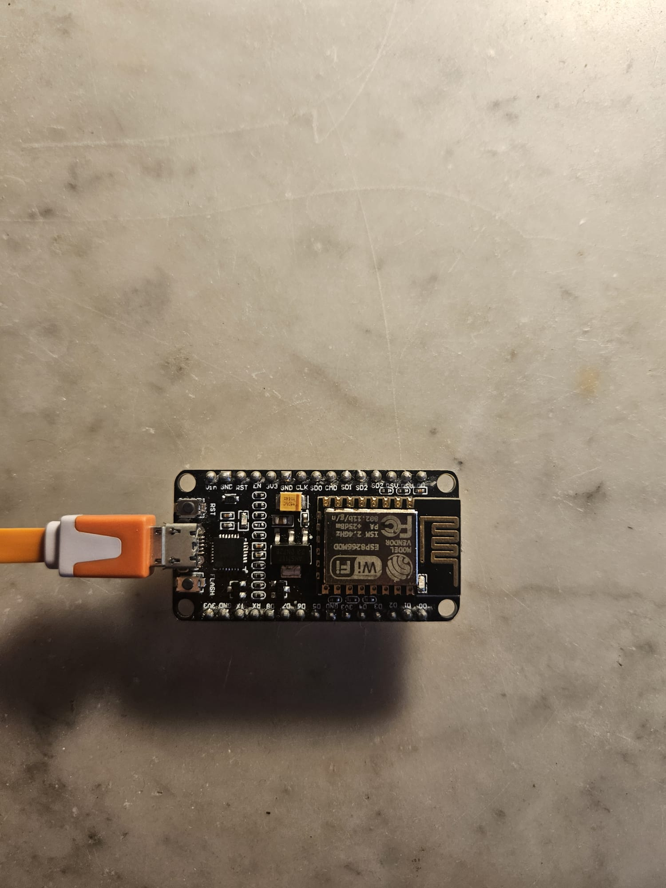
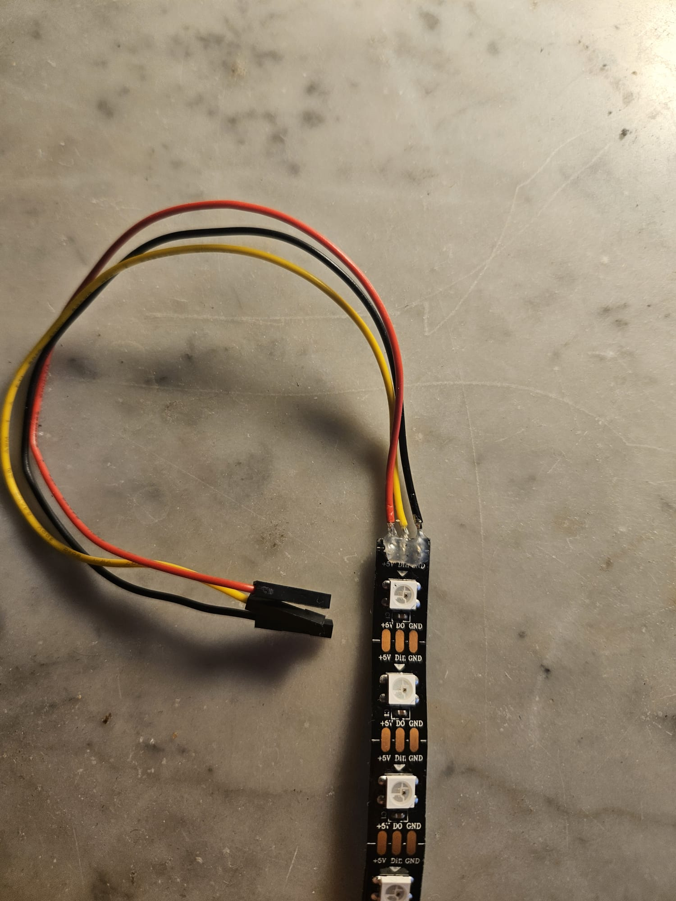
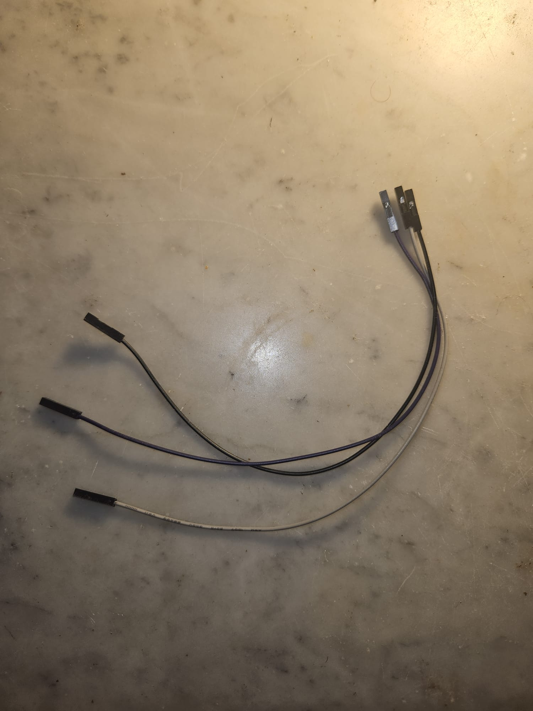

<h1>Smart Space Heater with ESP8266 and Telegram</h1>

This project enables you to control a space heater remotely through Telegram using an ESP8266 microcontroller. It utilizes a WS2812B RGB LED strip to indicate the status of the heater and features both manual and automatic modes, allowing the heater to turn on or off based on temperature data retrieved from OpenWeatherMap.

<h2>🛠️ Requirements</h2>
<h3>Hardware</h3>
<ul>
    <li><strong>ESP8266 Microcontroller:</strong> NodeMCU ESP 8266.</li>
    <li><strong>WS2812B RGB LED Strip:</strong> To visually indicate the heater's status.</li>
    <li><strong>Pushbutton:</strong> To toggle between automatic mode.</li>
    <li><strong>Jumper Wires:</strong> For making electrical connections.</li>
    <li><strong>USB Cable:</strong> To connect the ESP8266 to your computer for programming.</li>
</ul>

<table>
    <tr>
        <td style="text-align: center; margin: 10px;">
            
            
Button 1

        </td>
        <td style="text-align: center; margin: 10px;">
            
            
Button 2

        </td>
        <td style="text-align: center; margin: 10px;">
            
            
Button 3

        </td>
        <td style="text-align: center; margin: 10px;">
            
            
Button 4

        </td>
        <td style="text-align: center; margin: 10px;">
            
            
Button 5

        </td>
    </tr>
</table>

<h3>Software</h3>
<ul>
    <li><strong>Arduino IDE:</strong> The integrated development environment for programming the ESP8266.</li>
    <li><strong>Required Libraries:</strong> Install the following libraries in the Arduino IDE:
        <ul>
            <li><code>ESP8266WiFi:</code> For WiFi connectivity.</li>
            <li><code>WiFiClientSecure:</code> For secure client connections.</li>
            <li><code>UniversalTelegramBot:</code> For communication with Telegram.</li>
            <li><code>Adafruit NeoPixel:</code> For controlling the WS2812B LED strip.</li>
            <li><code>ArduinoJson:</code> For parsing JSON data from OpenWeatherMap.</li>
        </ul>
    </li>
</ul>

<h2>⚙️ Step 1: Setting Up Arduino IDE</h2>
<h3>1. Install ESP8266 Support</h3>

Follow these steps to add ESP8266 support in the Arduino IDE:

<ol>
    <li>Open the Arduino IDE.</li>
    <li>Go to <strong>File > Preferences</strong>.</li>
    <li>In the <strong>Additional Board Manager URLs</strong> field, paste the following URL:</li>
    <pre>http://arduino.esp8266.com/stable/package_esp8266com_index.json</pre>
    <li>Click OK to close the preferences window.</li>
    <li>Next, navigate to <strong>Tools > Board > Board Manager</strong>.</li>
    <li>Type <strong>ESP8266</strong> in the search bar and click the Install button for the ESP8266 by ESP8266 Community.</li>
</ol>

<h3>2. Install Libraries</h3>

To install the required libraries, follow these steps:

<ol>
    <li>In the Arduino IDE, go to <strong>Sketch > Include Library > Manage Libraries</strong>.</li>
    <li>In the Library Manager window, use the search bar to find and install the following libraries:
        <ul>
            <li><code>ESP8266WiFi</code></li>
            <li><code>WiFiClientSecure</code></li>
            <li><code>UniversalTelegramBot</code></li>
            <li><code>Adafruit NeoPixel</code></li>
            <li><code>ArduinoJson</code></li>
        </ul>
    </li>
</ol>

<h2>🔌 Step 2: Hardware Connections</h2>

Follow these steps to connect the hardware components:

<ul>
    <li><strong>LED Strip:</strong> Connect the data pin (DIN) of the LED strip to D2 on the ESP8266. Connect the power (5V) and ground (GND) pins of the LED strip to the corresponding pins on the ESP8266.</li>
    <li><strong>Pushbutton:</strong> Connect one terminal of the button to D1 on the ESP8266 and the other terminal to GND.</li>
</ul>

<h2>📝 Step 3: Configure and Upload Code</h2>

To upload the code to the ESP8266, follow these steps:

<ol>
    <li>Open the Arduino IDE and paste the code below into a new sketch.</li>
    <li>Replace the placeholders for your WiFi credentials, OpenWeatherMap API key, and Telegram Bot Token with your own values.</li>
</ol>

<pre><code>#include &lt;ESP8266WiFi.h&gt;
#include &lt;WiFiClientSecure.h&gt;
#include &lt;UniversalTelegramBot.h&gt;
#include &lt;Adafruit_NeoPixel.h&gt;
#include &lt;ArduinoJson.h&gt;

// WiFi network credentials
#define WIFI_SSID "your_wifi_ssid"       
#define WIFI_PASSWORD "your_wifi_password"   

// OpenWeatherMap API settings
const char* server = "api.openweathermap.org";
String city = "Amsterdam,NL";        
String apiKey = "your_api_key";      

// Telegram BOT Token
#define BOT_TOKEN "your_bot_token"
const unsigned long BOT_MTBS = 5000; 

X509List cert(TELEGRAM_CERTIFICATE_ROOT);
WiFiClientSecure secured_client;
UniversalTelegramBot bot(BOT_TOKEN, secured_client);
WiFiClient client;

unsigned long bot_lasttime = 0; 

#define LED_STRIP_PIN D2
#define NUM_LEDS 8
Adafruit_NeoPixel strip(NUM_LEDS, LED_STRIP_PIN, NEO_GRB + NEO_KHZ800);

#define BUTTON_PIN D1
bool autoMode = false;
bool lastButtonState = HIGH;
bool ledState = false;

unsigned long lastWeatherUpdate = 0;
const unsigned long weatherInterval = 10 * 60 * 1000; // 10 minutes
float tempThreshold = 20.0; // Temperature threshold in degrees Celsius

void setup() {
  Serial.begin(115200);
  Serial.println();

  Serial.print("Connecting to WiFi SSID ");
  Serial.print(WIFI_SSID);
  WiFi.begin(WIFI_SSID, WIFI_PASSWORD);
  secured_client.setTrustAnchors(&cert);

  while (WiFi.status() != WL_CONNECTED) {
    Serial.print(".");
    delay(500);
  }
  Serial.print("\nWiFi connected. IP address: ");
  Serial.println(WiFi.localIP());

  strip.begin();
  strip.show();

  pinMode(BUTTON_PIN, INPUT_PULLUP);

  // Set time via NTP
  configTime(0, 0, "pool.ntp.org");
  time_t now = time(nullptr);
  while (now < 24 * 3600) {
    delay(100);
    now = time(nullptr);
  }
}

void loop() {
  checkButton();

  if (millis() - bot_lasttime > BOT_MTBS) {
    int numNewMessages = bot.getUpdates(bot.last_message_received + 1);
    while (numNewMessages) {
      handleNewMessages(numNewMessages);
      numNewMessages = bot.getUpdates(bot.last_message_received + 1);
    }
    bot_lasttime = millis();
  }

  if (autoMode && millis() - lastWeatherUpdate > weatherInterval) {
    getWeatherData();
    lastWeatherUpdate = millis();
  }
}

void getWeatherData() {
  if (client.connect(server, 80)) {
    Serial.println("Connected to weather server");
    client.println("GET /data/2.5/weather?q=" + city + "&appid=" + apiKey + "&units=metric HTTP/1.1");
    client.println("Host: api.openweathermap.org");
    client.println("Connection: close");
    client.println();

    unsigned long timeout = millis();
    while (client.available() == 0) {
      if (millis() - timeout > 5000) {
        Serial.println(">>> Client Timeout!");
        client.stop();
        return;
      }
    }

    String line;
    while (client.available()) {
      line = client.readStringUntil('\n');
      if (line.startsWith("{")) {
        parseWeatherData(line);
        break;
      }
    }
  } else {
    Serial.println("Connection to weather server failed");
  }
}

void parseWeatherData(String jsonString) {
  DynamicJsonDocument doc(1024);
  DeserializationError error = deserializeJson(doc, jsonString);

  if (error) {
    Serial.print("JSON parsing failed: ");
    Serial.println(error.c_str());
    return;
  }

  float temperature = doc["main"]["temp"];
  Serial.print("Current temperature: ");
  Serial.println(temperature);

  if (autoMode && temperature < tempThreshold) {
    setStripColor(255, 0, 0);  // Set LED to red if it's cold
    ledState = true;           
    Serial.println("LED on (cold)");
  } else if (autoMode) {
    setStripColor(0, 0, 0); // Turn off LED if warm
    ledState = false;           
  }
}

void setStripColor(uint8_t r, uint8_t g, uint8_t b) {
  for (int i = 0; i < NUM_LEDS; i++) {
    strip.setPixelColor(i, strip.Color(r, g, b));
  }
  strip.show();
}

void checkButton() {
  bool buttonState = digitalRead(BUTTON_PIN);
  if (buttonState == LOW && lastButtonState == HIGH) {
    autoMode = !autoMode; // Toggle between modes
    if (autoMode) {
      setStripColor(0, 255, 0); // Set LED to green in automatic mode
      Serial.println("Automatic mode enabled.");
      getWeatherData(); // Get weather data immediately upon entering auto mode
    } else {
      setStripColor(255, 255, 255); // Set LED to white in manual mode
      Serial.println("Manual mode enabled.");
    }
    delay(200);  
  }
  lastButtonState = buttonState;
}

void handleNewMessages(int numNewMessages) {
  for (int i = 0; i < numNewMessages; i++) {
    String message = bot.messages[i].text;
    String chat_id = bot.messages[i].chat_id;
    Serial.print("Received message: ");
    Serial.println(message);

    if (message == "Heater on") {
      setStripColor(155, 155, 155); // Set LED to grey when heater is on
      ledState = true; 
      bot.sendMessage(chat_id, "The heater is on. Send 'Heater off' to turn it off.", "");
    } else if (message == "Heater off") {
      setStripColor(0, 0, 0);  // Turn off LED
      ledState = false; 
      autoMode = false; // Disable automatic mode
      bot.sendMessage(chat_id, "Heater off. Send 'Heater on' to turn it back on or press the button for automatic heating.", "");
    } else if (message == "Auto heat") {
      autoMode = true;  
      getWeatherData(); 
      bot.sendMessage(chat_id, "Automatic heating mode activated! Your heater will operate based on current temperature.", "");
    } else if (message == "Help") {
      bot.sendMessage(chat_id, "🆘 Available commands:\n"
          "• 'Heater on' - Turn the heater on.\n"
          "• 'Heater off' - Turn the heater off.\n"
          "• 'Auto heat' - Enable automatic heating based on the weather.\n"
          "• '<temperature> degrees' - Change LED color based on the specified temperature (10-30 degrees).\n"
          "• 'Help' - Show this help message.", "");
    } else if (message.endsWith("degrees")) {
      handleTemperatureMessage(message, chat_id);
    } else {
      bot.sendMessage(chat_id, "I don't understand. Type 'Help' for a list of commands.", "");
    }
  }
}

void handleTemperatureMessage(String message, String chat_id) {
  message.replace("degrees", "");
  message.trim();  
  int tempValue = message.toInt();

  if (tempValue >= 10 && tempValue < 20) {
    setStripColor(0, 255, 0);  
    bot.sendMessage(chat_id, "Temperature set to green for range 10-19°C.", "");
  } else if (tempValue >= 20 && tempValue <= 30) {
    setStripColor(255, 165, 0);  
    bot.sendMessage(chat_id, "Temperature set to orange for range 20-30°C.", "");
  } else {
    bot.sendMessage(chat_id, "Please enter a temperature between 10 and 30 degrees.", "");
  }
}
</code></pre>

<h2>📱 Step 4: Set Up Your Telegram Bot</h2>

To set up your Telegram bot:

<ol>
    <li>Open Telegram and search for <strong>BotFather</strong>.</li>
    <li>Start a chat with BotFather and use the command <strong>/newbot</strong> to create a new bot.</li>
    <li>Follow the instructions to obtain your Bot Token, which you'll need to replace in the code.</li>
</ol>

<h2>✅ Step 5: Enjoy Your Smart Space Heater!</h2>

Once everything is set up, you can control your space heater via Telegram using the following commands:

<ul>
    <li><strong>Heater on:</strong> Turns the heater on.</li>
    <li><strong>Heater off:</strong> Turns the heater off.</li>
    <li><strong>Auto heat:</strong> Enables automatic heating based on the weather data.</li>
    <li><strong>&lt;temperature&gt; degrees:</strong> Changes the LED color based on the specified temperature range (10-30 degrees).</li>
    <li><strong>Help:</strong> Displays a list of available commands.</li>
</ul>

Enjoy your smart space heater!

