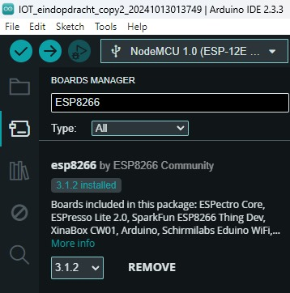
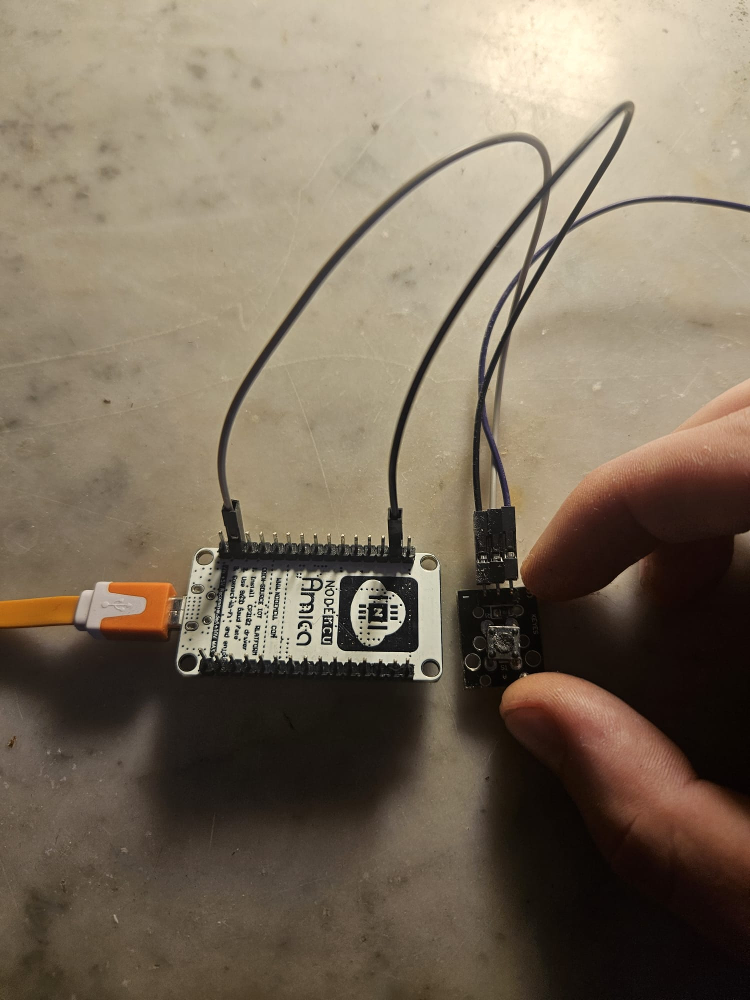
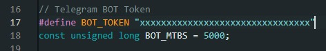

<h1>Smart Space Heater with ESP8266 and Telegram</h1>

This project enables you to control a space heater remotely through Telegram using an ESP8266 microcontroller. It utilizes a WS2812B RGB LED strip to indicate the status of the heater and features both manual and automatic modes, allowing the heater to turn on or off based on temperature data retrieved from OpenWeatherMap.

<h2>🛠️ Requirements</h2>
<h3>Hardware</h3>
<ul>
    <li><strong>ESP8266 Microcontroller:</strong> NodeMCU ESP 8266.</li>
    <li><strong>WS2812B RGB LED Strip:</strong> To visually indicate the heater's status.</li>
    <li><strong>Pushbutton:</strong> To toggle between automatic mode.</li>
    <li><strong>Jumper Wires:</strong> For making electrical connections.</li>
    <li><strong>USB Cable:</strong> To connect the ESP8266 to your computer for programming.</li>
</ul>

<table>
    <tr>
        <td style="text-align: center; margin: 10px;">
            
            
Microcontroller

        </td>
        <td style="text-align: center; margin: 10px;">
            
            
RGB LED Strip

        </td>
        <td style="text-align: center; margin: 10px;">
            
            
Pushbutton

        </td>
                <td style="text-align: center; margin: 10px;">
            
            
Jumper Wires

        </td>
        <td style="text-align: center; margin: 10px;">
            
            
USB Cable

        </td>
    </tr>
</table>

<h3>Software</h3>
<ul>
    <li><strong>Arduino IDE:</strong> The integrated development environment for programming the ESP8266.</li>
</ul>

<h2>⚙️ Step 1: Setting Up Arduino IDE</h2>
<h3>1. Install ESP8266 Support</h3>

Follow these steps to add ESP8266 support in the Arduino IDE:

<ol>
    <li>Open the Arduino IDE.</li>
    <li>Go to <strong>File > Preferences</strong>.</li>
    
    <li>In the <strong>Additional Board Manager URLs</strong> field, paste the following URL:</li>
    <pre>http://arduino.esp8266.com/stable/package_esp8266com_index.json</pre>
    <li>Click OK to close the preferences window.</li>
    
    <li>Next, navigate to <strong>Tools > Board > Board Manager</strong>.</li>
     
    <li>Type <strong>ESP8266</strong> in the search bar and click the Install button for the ESP8266 by ESP8266 Community.</li>
    
</ol>

<h3>2. Install Libraries</h3>

To install the required libraries, follow these steps:

<ol>
    <li>In the Arduino IDE, go to <strong>Sketch > Include Library > Manage Libraries</strong>.</li>
    <li>In the Library Manager window, use the search bar to find and install the following libraries:
        <ul>
            <li><code>ESP8266WiFi</code></li>
            <li><code>WiFiClientSecure</code></li>
            <li><code>UniversalTelegramBot</code></li>
            <li><code>Adafruit NeoPixel</code></li>
            <li><code>ArduinoJson</code></li>
            <li></li></li>
        </ul>
    </li>
</ol>

<h3>🔌 Troubleshooting:</h3>
<ul>
    <li>If the LED strip does not light up, check the wiring connections to ensure they are secure.</li>
    <li>Make sure the ESP8266 is powered properly and receiving voltage.</li>
    <li>**ChatGPT Tip:** If you're unsure about wiring diagrams, ask ChatGPT for clarification on specific connections or common wiring errors.</li>
</ul>

<h2>🔌 Step 2: Hardware Connections</h2>

Follow these steps to connect the hardware components:

<ul>
    <li><strong>LED Strip:</strong> Connect the data pin (DIN) (yellow) of the LED strip to D2 on the ESP8266. Connect the power (5V) (red) to the 3v3 pin and ground (GND) (black) to the GND pin.</li>
    
    <li><strong>Pushbutton:</strong> Connect the black wire (left pin of the button) to the D1 pin of the ESP8266 and the grey wire (middle pin of the button) to a GND pin on the ESP 8266. <strong> Important:</strong> the purple wire of the button (right pin) should not be connected.</li>
    
</ul>

<h3>📝 Troubleshooting:</h3>
<ul>
    <li>If the upload fails, ensure that the correct board and port are selected in the Arduino IDE.</li>
    <li>Check that the ESP8266 is properly connected to your computer.</li>
    <li>**ChatGPT Tip:** If you encounter specific error messages during the upload process, provide the error to ChatGPT for potential solutions or troubleshooting steps.</li>
</ul>

<h2>📝 Step 3: Configure and Upload Code</h2>

To upload the code to the ESP8266, follow these steps:

<ol>
    <li>Open the Arduino IDE and paste the code below into a new sketch.</li>
    <li>Replace the placeholders for your WiFi credentials. Fill your ssid in at line 8 between the brackets and in line 9 your wifi password.
    The ESP 8266 needs this to make a connection to wifi.</li>
</ol>
<h3>🌐 Troubleshooting:</h3>
<ul>
    <li>If you don't receive responses from the bot, check your internet connection and ensure the ESP8266 is connected to WiFi.</li>
    <li>Verify that the Bot Token is correctly placed in the code.</li>
    <li>**ChatGPT Tip:** If the bot isn't responding, ask ChatGPT for common troubleshooting steps for Telegram bots or how to check API connections.</li>
</ul>

<pre><code>#include &lt;ESP8266WiFi.h&gt;
#include &lt;WiFiClientSecure.h&gt;
#include &lt;UniversalTelegramBot.h&gt;
#include &lt;Adafruit_NeoPixel.h&gt;
#include &lt;ArduinoJson.h&gt;

// WiFi network credentials
#define WIFI_SSID "your_wifi_ssid"       
#define WIFI_PASSWORD "your_wifi_password"   

// OpenWeatherMap API settings
const char* server = "api.openweathermap.org";
String city = "Amsterdam,NL";        
String apiKey = "your_api_key";      

// Telegram BOT Token
#define BOT_TOKEN "your_bot_token"
const unsigned long BOT_MTBS = 5000; 

X509List cert(TELEGRAM_CERTIFICATE_ROOT);
WiFiClientSecure secured_client;
UniversalTelegramBot bot(BOT_TOKEN, secured_client);
WiFiClient client;

unsigned long bot_lasttime = 0; 

#define LED_STRIP_PIN D2
#define NUM_LEDS 8
Adafruit_NeoPixel strip(NUM_LEDS, LED_STRIP_PIN, NEO_GRB + NEO_KHZ800);

#define BUTTON_PIN D1
bool autoMode = false;
bool lastButtonState = HIGH;
bool ledState = false;

unsigned long lastWeatherUpdate = 0;
const unsigned long weatherInterval = 10 * 60 * 1000; // 10 minutes
float tempThreshold = 20.0; // Temperature threshold in degrees Celsius

void setup() {
  Serial.begin(115200);
  Serial.println();

  Serial.print("Connecting to WiFi SSID ");
  Serial.print(WIFI_SSID);
  WiFi.begin(WIFI_SSID, WIFI_PASSWORD);
  secured_client.setTrustAnchors(&cert);

  while (WiFi.status() != WL_CONNECTED) {
    Serial.print(".");
    delay(500);
  }
  Serial.print("\nWiFi connected. IP address: ");
  Serial.println(WiFi.localIP());

  strip.begin();
  strip.show();

  pinMode(BUTTON_PIN, INPUT_PULLUP);

  // Set time via NTP
  configTime(0, 0, "pool.ntp.org");
  time_t now = time(nullptr);
  while (now < 24 * 3600) {
    delay(100);
    now = time(nullptr);
  }
}

void loop() {
  checkButton();

  if (millis() - bot_lasttime > BOT_MTBS) {
    int numNewMessages = bot.getUpdates(bot.last_message_received + 1);
    while (numNewMessages) {
      handleNewMessages(numNewMessages);
      numNewMessages = bot.getUpdates(bot.last_message_received + 1);
    }
    bot_lasttime = millis();
  }

  if (autoMode && millis() - lastWeatherUpdate > weatherInterval) {
    getWeatherData();
    lastWeatherUpdate = millis();
  }
}

void getWeatherData() {
  if (client.connect(server, 80)) {
    Serial.println("Connected to weather server");
    client.println("GET /data/2.5/weather?q=" + city + "&appid=" + apiKey + "&units=metric HTTP/1.1");
    client.println("Host: api.openweathermap.org");
    client.println("Connection: close");
    client.println();

    unsigned long timeout = millis();
    while (client.available() == 0) {
      if (millis() - timeout > 5000) {
        Serial.println(">>> Client Timeout!");
        client.stop();
        return;
      }
    }

    String line;
    while (client.available()) {
      line = client.readStringUntil('\n');
      if (line.startsWith("{")) {
        parseWeatherData(line);
        break;
      }
    }
  } else {
    Serial.println("Connection to weather server failed");
  }
}

void parseWeatherData(String jsonString) {
  DynamicJsonDocument doc(1024);
  DeserializationError error = deserializeJson(doc, jsonString);

  if (error) {
    Serial.print("JSON parsing failed: ");
    Serial.println(error.c_str());
    return;
  }

  float temperature = doc["main"]["temp"];
  Serial.print("Current temperature: ");
  Serial.println(temperature);

  if (autoMode && temperature < tempThreshold) {
    setStripColor(255, 0, 0);  // Set LED to red if it's cold
    ledState = true;           
    Serial.println("LED on (cold)");
  } else if (autoMode) {
    setStripColor(0, 0, 0); // Turn off LED if warm
    ledState = false;           
  }
}

void setStripColor(uint8_t r, uint8_t g, uint8_t b) {
  for (int i = 0; i < NUM_LEDS; i++) {
    strip.setPixelColor(i, strip.Color(r, g, b));
  }
  strip.show();
}

void checkButton() {
  bool buttonState = digitalRead(BUTTON_PIN);
  if (buttonState == LOW && lastButtonState == HIGH) {
    autoMode = !autoMode; // Toggle between modes
    if (autoMode) {
      setStripColor(0, 255, 0); // Set LED to green in automatic mode
      Serial.println("Automatic mode enabled.");
      getWeatherData(); // Get weather data immediately upon entering auto mode
    } else {
      setStripColor(255, 255, 255); // Set LED to white in manual mode
      Serial.println("Manual mode enabled.");
    }
    delay(200);  
  }
  lastButtonState = buttonState;
}

void handleNewMessages(int numNewMessages) {
  for (int i = 0; i < numNewMessages; i++) {
    String message = bot.messages[i].text;
    String chat_id = bot.messages[i].chat_id;
    Serial.print("Received message: ");
    Serial.println(message);

    if (message == "Heater on") {
      setStripColor(155, 155, 155); // Set LED to grey when heater is on
      ledState = true; 
      bot.sendMessage(chat_id, "The heater is on. Send 'Heater off' to turn it off.", "");
    } else if (message == "Heater off") {
      setStripColor(0, 0, 0);  // Turn off LED
      ledState = false; 
      autoMode = false; // Disable automatic mode
      bot.sendMessage(chat_id, "Heater off. Send 'Heater on' to turn it back on or press the button for automatic heating.", "");
    } else if (message == "Auto heat") {
      autoMode = true;  
      getWeatherData(); 
      bot.sendMessage(chat_id, "Automatic heating mode activated! Your heater will operate based on current temperature.", "");
    } else if (message == "Help") {
      bot.sendMessage(chat_id, "🆘 Available commands:\n"
          "• 'Heater on' - Turn the heater on.\n"
          "• 'Heater off' - Turn the heater off.\n"
          "• 'Auto heat' - Enable automatic heating based on the weather.\n"
          "• '<temperature> degrees' - Change LED color based on the specified temperature (10-30 degrees).\n"
          "• 'Help' - Show this help message.", "");
    } else if (message.endsWith("degrees")) {
      handleTemperatureMessage(message, chat_id);
    } else {
      bot.sendMessage(chat_id, "I don't understand. Type 'Help' for a list of commands.", "");
    }
  }
}

void handleTemperatureMessage(String message, String chat_id) {
  message.replace("degrees", "");
  message.trim();  
  int tempValue = message.toInt();

  if (tempValue >= 10 && tempValue < 20) {
    setStripColor(0, 255, 0);  
    bot.sendMessage(chat_id, "Temperature set to green for range 10-19°C.", "");
  } else if (tempValue >= 20 && tempValue <= 30) {
    setStripColor(255, 165, 0);  
    bot.sendMessage(chat_id, "Temperature set to orange for range 20-30°C.", "");
  } else {
    bot.sendMessage(chat_id, "Please enter a temperature between 10 and 30 degrees.", "");
  }
}
</code></pre>

<h2>📱 Step 4: Get your weather API</h2>

<ol>
    <li>Go to https://openweathermap.org and make a account.</li>
    <li> When you have a account go to the top right of your screen where your account is located, there you will find 'My API keys'</li>
    
    <li>On this page you can find your keys, copy the key and past it on between the brackets on line 14 of the sketch in the arduino IDE</li>
    <ul>
        <li style="text-align: center; margin: 10px;">
            
            
API key on the website

        </li>
        <li style="text-align: center; margin: 10px;">
            
            
API key pasted on line 14

        </li>
    </ul>

</ol>

<h3>📱 Troubleshooting:</h3>
<ul>
    <li>If you can't find your API key, ensure you are logged into your OpenWeatherMap account correctly.</li>
    <li>If you do not have access to 'My API keys', make sure your account is properly verified.</li>
    <li>**ChatGPT Tip:** If you have questions about how to use an API key or where to input it in the Arduino IDE, ask ChatGPT for guidance and examples.</li>
</ul>

<h2>📱 Step 5: Set Up Your Telegram Bot</h2>

To set up your Telegram bot:

<ol>
    <li>Download and open Telegram and search for <strong>BotFather</strong>.</li>
   
    <li>Start a chat with BotFather and use the command <strong>/newbot</strong>, follow the constructions to get <strong>a bot token</strong> and to create a new bot.</li>
               
      <li> Paste the token the bot gave you on line 17 between the brackets:</li>
 
</ol>

<h3>📱 Troubleshooting:</h3>
<ul>
    <li>If BotFather does not respond, check your internet connection or try reconnecting to Telegram.</li>
    <li>Ensure you are following the correct steps to create a new bot; type `/newbot` accurately.</li>
    <li>**ChatGPT Tip:** If you encounter issues generating a bot token, ask ChatGPT for step-by-step instructions on using Telegram bots or troubleshooting common problems.</li>
</ul>

<h2> 💻 Step 6: Run the code</h2>

Now that you put all your data in, we can run the code

<ul>
    <li>On the top right of your screen there is a blue arrow, press on this arrow to run the code</li>
    
    <li>If al the information that you put in is right and all the hardware works as expected then you can see in the serial monitor what the system is doing. The serial monitor can be 
    found in the top right of your screen </li>
    
    <li>In the serial monitor it should say: 'Wifi Connected'. With your IP adress behind it.</li>
</ul>
<h2>💻 Troubleshooting:</h2>
<ul>
    <li>If your code does not run, check that you have the correct settings in the Arduino IDE, such as the right board and port settings.</li>
    <li>If you do not see 'Wifi Connected' in the serial monitor, check your WiFi settings and the ESP connection.</li>
    <li>**ChatGPT Tip:** If you experience issues running the code, ask ChatGPT for help with debugging error messages or understanding how to use the serial monitor.</li>
</ul>

<h2>✅ Step 6: Enjoy Your Smart Space Heater!</h2>

 In the serial monitor you can see what the system is doing and you can see the messages it recieves.:

Once everything is set up, you can control your space heater via Telegram using the following commands:

<ul>
    <li><strong>Heater on:</strong> Turns the heater on.</li>
    <table>
    <tr>
     <td style="text-align: center; margin: 10px;">
     
     
The user sends: heater on, the heater turns on.

    </td>
     <td style="text-align: center; margin: 10px;">
     
     
The heater turns on and the serial monitor confirms it.

     </td> 
    </tr>
    </table>
    <li><strong>Heater off:</strong> Turns the heater off.</li>
    <table>
    <tr>
     <td style="text-align: center; margin: 10px;">
     
     
The user sends: heater off, the heater turns off.

    </td>
     <td style="text-align: center; margin: 10px;">
     
     
The heater turns off and the serial monitor confirms it.

     </td> 
    </tr>
    </table>
    <li><strong>Auto heat:</strong> Enables automatic heating based on the weather data. The ESP makes a connection with the weather API to give the right data.</li>
    <table>
    <tr>
     <td style="text-align: center; margin: 10px;">
     
     
The user sends: Auto heat, the heater turns on..

    </td>
     <td style="text-align: center; margin: 10px;">
     
     
The serial monitor shows that it made a connection with the weather API and it shows a value.

     </td> 
    </tr>
    </table>
    <li><strong>&lt;temperature&gt; degrees:</strong> Changes the LED color based on the specified temperature range (10-30 degrees).</li>
    <table>
    <tr>
     <td style="text-align: center; margin: 10px;">
     
     
The user sends: 15 degrees, the heater turns on and heats accordingly.

    </td>
     <td style="text-align: center; margin: 10px;">
     
     
The serial monitor shows that it made a connection with the weather API and it shows a value.

     </td> 
    </tr>
    </table>
    <li><strong>Help:</strong> Displays a list of available commands.</li>
     
    <h2>✅ Troubleshooting:</h2>
    <ul>
    <li>If the commands are not working, verify that you have entered the correct bot token and that the ESP8266 is connected to the internet.</li>
    <li>If the heater does not respond, check the hardware connections and ensure the LED strip is properly connected.</li>
    <li>**ChatGPT Tip:** For help with specific commands that are not functioning or to understand why certain features are not working, ask ChatGPT for tips and advice.</li>
    </ul>
    
Enjoy your smart space heater!

